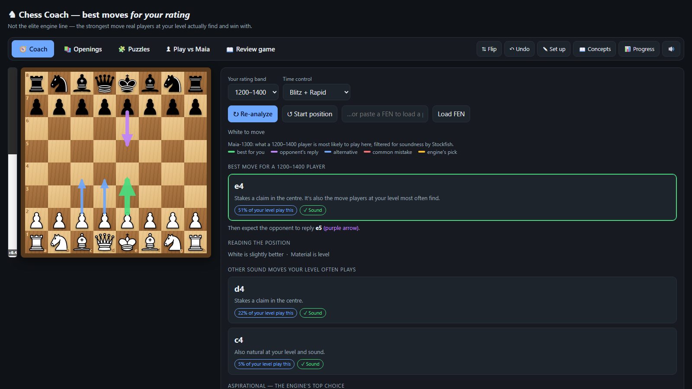

# Chess Coach — Best Moves *For Your Rating*

A local web app that reviews your chess games and shows the strongest move a
player **of your own rating** would realistically find — not the perfect engine
move you'll never play. It runs two engines side by side: **Maia** (a neural net
trained to imitate human play at a given Elo) for *"what a human at this level
actually plays,"* and **Stockfish** for *"is that move actually sound?"* The
recommendation is the most human-likely move that Stockfish confirms is good.

Everything runs **100% locally** on your machine — no accounts, no cloud, no data
leaves your computer.

> **Note on fair play:** This is a *post-game* review and training tool. Using an
> engine during a live rated game is cheating on every major chess site. See
> [Responsible use](#responsible-use).

---

## Why this exists

Every chess engine and site will tell you the *objectively best* move. But if
you're rated 1200, being told to find a deep 2400-level sacrifice teaches you
nothing — you'd never spot it over the board, and playing it wouldn't fit how you
actually think.

Chess Coach answers a more useful question: **"What's the best move a player at
*my* level would find here?"** A move that is both *sound* and *typical* for your
rating — strong, but learnable. That makes post-game review feel like advice from
a coach one or two levels above you, instead of an oracle you can't relate to.

## Features

- **Rating-aware move suggestions** — pick a rating band (1100–1900); the coach
  recommends the best *human-likely* move for that level and draws it as an arrow
  on the board.
- **Game review from PGN** — paste a finished game, step through it move by move,
  and see each move graded (fine / inaccuracy / mistake) against the
  rating-appropriate recommendation.
- **Puzzle trainer** — ~2,600 puzzles spanning ratings 400–3000 (from the Lichess
  open database), with Easy/Medium/Hard difficulty and theme drills.
- **Progress tracking** — an Elo-style puzzle rating, solve streaks, per-theme
  accuracy, and a weakness dashboard that turns your weak spots into a study plan.
- **Plain-language explanations** — every recommendation comes with a *why*
  (material gain, a fork, king safety, development…), derived only from verifiable
  engine signals — it never makes things up.
- **Position setup** — drag pieces onto the board to analyse any position.
- **Play vs. Maia** — practise against a human-like opponent at a chosen rating.
- Fully keyboard-navigable review, move sounds, light/dark theme.

## Screenshot



---

## How it works

The interesting part of this project is the two-engine pipeline that turns
"objective best move" into "best move *for you*":

```
                 ┌─────────────────────────────────────────────┐
   position ───▶ │ Maia (lc0 + Maia weights)                   │
   (FEN)         │ "what a 1500 human plays here"              │
                 │ → a probability distribution over moves     │
                 └───────────────────┬─────────────────────────┘
                                     │ top ~6 human moves
                                     ▼
                 ┌─────────────────────────────────────────────┐
                 │ Stockfish (MultiPV, searchmoves)            │
                 │ "is each of those moves actually sound?"    │
                 │ → centipawn eval + principal variation      │
                 └───────────────────┬─────────────────────────┘
                                     ▼
              Recommendation = most human-likely move
              that Stockfish confirms loses ≤ 60 centipawns.
              Also flags: your level's common mistakes, and
              the aspirational engine-best move.
```

- **Maia** is the [CSSLab Maia](https://maiachess.com/) family of nets, run through
  **lc0** at `go nodes 1`. At one node, the net's *policy priors* are exactly its
  predicted human move distribution — so a single fast forward pass tells us what a
  player of that rating is most likely to play.
- **Stockfish** evaluates *exactly* Maia's top handful of candidate moves (via UCI
  `searchmoves`), so even a popular-but-dubious "trap" move gets a real evaluation
  rather than being ignored for the engine's own favourite.
- The **backend** (`maia_server.py`) is a small Python standard-library HTTP server
  that keeps each engine running as a persistent pooled process and exposes them as
  JSON endpoints. The **frontend** (`chess-coach.html`) is a single self-contained
  page — board, analysis, puzzles, and progress tracking — talking to those
  endpoints.

### Backend endpoints

| Endpoint | Purpose |
|---|---|
| `GET /` | serves the app (`chess-coach.html`) |
| `GET /maia?fen=&rating=` | Maia policy — the human move distribution for that rating |
| `GET /eval?fen=&moves=` | Stockfish MultiPV eval + principal variations |
| `GET /puzzle?rating=&diff=&theme=` | a random puzzle matching the criteria |
| `GET /health` | engine + puzzle-bank status |

---

## Getting started

### Prerequisites

- **Windows** (the setup script and bundled engines target Windows; the Python
  server itself is cross-platform if you supply `lc0`/`stockfish` builds for your OS)
- **Python 3.10+** (uses only the standard library — no `pip install` needed to run)

### 1. Get the engines (one time)

The chess engines and neural-net weights are large third-party binaries and are
**not** included in this repo. Download them with the setup script:

```powershell
powershell -ExecutionPolicy Bypass -File maia/setup-maia.ps1
```

This fetches the latest **lc0** Windows CPU build, the five **Maia** weight files
(1100–1900), into `maia/`. You'll also need **Stockfish** — download a build from
[stockfishchess.org](https://stockfishchess.org/download/) and place the
executable at `maia/stockfish/stockfish.exe`.

### 2. Run it

```powershell
python maia_server.py
```

Wait for `Engines ready.` (the engines take ~10–20s to warm up on first start),
then open **http://localhost:8000/** in your browser.

On Windows you can just double-click **`start-chess.bat`**, which launches the
server and opens the page for you.

> Open the `http://localhost:8000/` URL — **not** the `.html` file directly. The
> page is served by the Python backend; opening it as a `file://` gives a blank
> board.

### 3. (Optional) Build the puzzle bank

A pre-built `puzzles.json` (~2,600 puzzles) is included. To regenerate or grow it:

```powershell
pip install zstandard
python build_puzzles.py --per 400
```

This streams the [Lichess puzzle database](https://database.lichess.org/#puzzles)
(CC0) and stops early once it has a spread across rating bands — it only downloads
a few MB of the 300 MB file.

---

## Project structure

```
chess-coach.html   Single-page frontend: board, analysis, puzzles, progress UI
maia_server.py     Python stdlib HTTP backend bridging the browser to the engines
chess.js           Local chess rules/move-generation library (UMD build)
pieces.js          SVG piece images (data-URIs)
openings.js        Opening-name lookup data
build_puzzles.py   Builds puzzles.json from the Lichess open puzzle database
puzzles.json       Pre-built local puzzle bank
start-chess.bat    Windows one-click launcher
maia/
  setup-maia.ps1   Downloads lc0 + Maia weights (engines are git-ignored)
```

## Engineering notes

A few problems worth calling out — the kind of thing that doesn't show up in the
feature list but ate real debugging time:

- **IPv6 `localhost` stall.** The server originally bound IPv4 only; Chrome resolves
  `localhost` to `::1` first and hung ~2s *per request* falling back. Fixed with a
  dual-stack socket (`AF_INET6` + `IPV6_V6ONLY=0`), cutting analysis latency from
  ~4s to ~0.6s.
- **Hung requests under rapid fetches.** Python's `http.server` defaults to HTTP/1.0
  (no keep-alive). Chrome reused a pooled socket the server had already closed, so
  requests vanished and saturated Chrome's 6-connections-per-host pool. Fixed by
  setting `protocol_version = "HTTP/1.1"` (every response already sends
  `Content-Length`, so persistent connections are safe).
- **Keeping engines warm.** Stockfish returns garbage if its stdin closes
  mid-search, so engines are held as long-lived pooled processes behind locks
  rather than spawned per request.
- **Castling notation.** lc0/Maia emit castling as king-onto-rook UCI (`e8h8`),
  which the chess.js build rejects; a normalisation step rewrites these to standard
  king-target UCI before the move is applied or explained.

## Responsible use

This tool is built for **post-game review, training, and study** — replaying
finished games, solving puzzles, and analysing positions you set up yourself.

Using any engine assistance during a **live rated game** is a fair-play violation
on Lichess, Chess.com, and every other major site — and, ironically,
rating-calibrated moves are exactly what human-imitation models like Maia are used
to *detect*. Please don't use this to cheat. The PGN-review workflow exists so the
tool is useful *after* the game, where it belongs.

## License & credits

This project's own code (`chess-coach.html`, `maia_server.py`, `build_puzzles.py`,
and the setup scripts) is released under the **MIT License** — see [LICENSE](LICENSE).

It builds on excellent open-source work, each under its own license:

- **[Stockfish](https://stockfishchess.org/)** — chess engine (GPLv3). Not bundled;
  downloaded separately by the user.
- **[Leela Chess Zero (lc0)](https://lczero.org/)** — engine used to run the Maia
  nets (GPLv3). Downloaded by `setup-maia.ps1`.
- **[Maia Chess](https://maiachess.com/)** ([CSSLab](https://csslab.cs.toronto.edu/))
  — human-imitation neural-net weights.
- **[chess.js](https://github.com/jhlywa/chess.js)** — move generation/validation (BSD).
- **[Lichess open database](https://database.lichess.org/)** — puzzle set (CC0).
